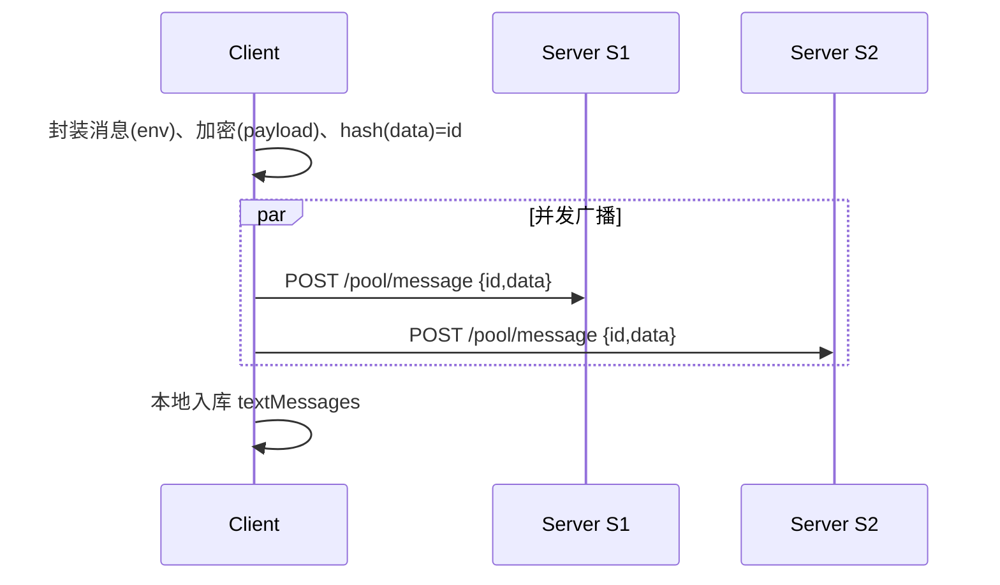
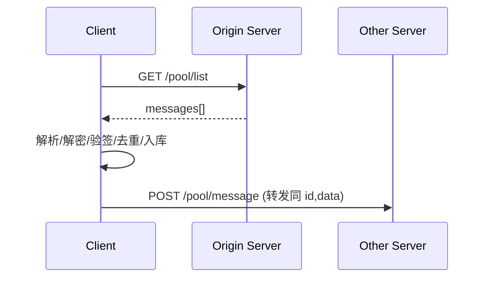

# MeshPath 网状聊天（客户端驱动复制）设计与使用说明

> 本文档面向希望在“服务端互不连通/用户自建”的前提下，仍通过“客户端多节点连接”实现消息跨节点传播的去中心化聊天场景。

---

## 1. 客户端实现逻辑与原理

### 1.1 核心功能模块
- useMeshChat（文本房间与消息）：
  - 发送：封装→加密→计算消息ID→并发广播到所有启用的服务器
  - 接收：轮询 /pool/list → 解析→解密→验签→去重入库→客户端中继（再转发至其他已启用服务器）
- useUser（用户与服务器列表）：
  - 维护当前用户密钥对、公钥、已启用的服务器列表（{ url, enabled }）
- Dexie 本地数据库：
  - textRooms、textMessages 等表，支撑本地持久化与去重检查
- unsea 加密与签名：
  - 加解密封装载荷（payload）
  - 发送时对“roomId:msg:ts”签名，接收时验签

### 1.2 数据通信流程
- 发送路径（客户端→多服务端）


- 接收与客户端中继（多服务端→客户端→其他服务端）


### 1.3 关键算法原理（精简伪码）
- 消息ID：对密文封装后的 data 进行 SHA-256 并 URL-Safe Base64
- 去重：
  - 内存 processed.has(id)
  - Dexie where(roomId).and(ts & senderPub) 查询
- 客户端中继：
```ts
// 收到并成功处理后执行（排除来源 serverUrl）
for (s of enabledServers) {
  if (normalize(s.url) !== normalize(serverUrl)) {
    fetch(`${s.url}/pool/message`, { method: 'POST', body: { id, data } })
  }
}
```
- 验签：发送端签名 `${roomId}:${msg}:${ts}`，接收端用 fromPub 验签。

### 1.4 性能优化策略
- 并行 I/O：Promise.all 并发广播与并发轮询
- 幂等写入：避免重复落盘带来的锁竞争
- 客户端与服务端双层去重：降低重复解析与重复 UI 渲染
- 仅轮询 /pool/list（轻量 JSON），TTL 定期清理历史消息文件
- 可选增强（建议后续）：失败重试队列、首轮“立即 poll”、去抖/节流 UI 刷新

---

## 2. 服务端实现逻辑与原理

### 2.1 系统架构
- Node.js + Express：提供 /pool/* REST 接口与静态文件
- 文件系统作为“消息池”（POOL_DIR）
- 全局 CORS 放行，便于浏览器跨源访问
- 可选：基于环境变量 RELAY_PEERS 的服务端联播（不是必需，客户端中继已可覆盖）

### 2.2 请求处理流程
```mermaid
flowchart TD
  A[POST /pool/message] --> B{同名 id.json 是否存在}
  B -- 是 --> C[直接返回 success]
  B -- 否 --> D[写入 id.json]
  D --> E[返回 success]
  E --> F{RELAY_PEERS?}
  F -- 是 --> G[异步转发到 peers]
  F -- 否 --> H[结束]

  I[GET /pool/list] --> J[读取 POOL_DIR/*.json]
  J --> K[过滤过期/损坏]
  K --> L[按 id 去重]
  L --> M[返回 messages[]]

  N[DELETE /pool/message/:id]
```

### 2.3 数据存储与管理
- 目录结构：POOL_DIR 下以 id.json 存放消息
- TTL 清理：定期跳过/清理过期消息，避免无限增长
- 幂等：已有文件直接返回 success，支撑多次转发/广播
- 去重：/pool/list 返回前对 id 去重

### 2.4 安全与信任边界
- 服务端不解密、不验签（内容对服务端透明），最小信任面
- CORS 允许跨源访问，仅限于 /pool/* API
- 大小/字段校验，拒绝超大消息
- 私钥仅保存在本地客户端；房间私钥用于加解密 payload

---

## 3. 使用方法指南

### 3.1 环境要求
- Node.js 18+（内置 fetch）
- 浏览器：现代 Chromium/Firefox/Safari
- 可选：pnpm 或 npm

### 3.2 安装与启动（开发）
```bash
# 前端（MeshPath）开发
cd MeshPath
pnpm i
pnpm run dev

# 服务端（同仓库根目录）
node server.js
```

### 3.3 环境变量示例（服务端）
```env
# 监听端口
RELAY_PORT=8765
# 消息池目录
POOL_DIR=./message_pool
# 过期清理（毫秒），如 24 小时
POOL_TTL_MS=86400000
# 可选：对端节点（服务端级联，不依赖）
RELAY_PEERS=http://peer.example.com:8766
```

### 3.4 常用操作
- 在前端 UI 的“服务器列表”中，添加多个 URL 并设为启用（enabled）
- 创建/加入文本房间：粘贴 rpub/rpriv（仅本地保存）
- 发送消息：客户端对所有启用的服务器并发广播
- 接收与转发：客户端轮询任一可达服务器并在成功处理后再转发至其他启用服务器，实现去中心化复制

### 3.5 命令/接口示例
```bash
# 拉取消息（任一服务器）
curl http://localhost:8765/pool/list

# 写入消息（仅调试）
curl -X POST http://localhost:8765/pool/message \
  -H 'Content-Type: application/json' \
  -d '{"id":"<hash>","data":"<encrypted>"}'
```

### 3.6 常见问题排查
- 只能部分好友看到消息：
  - 确认发送者是否在前端启用了多个服务器；
  - 至少有一位用户同时连向两个（或以上）服务器作为桥接；
  - 端口开放与 CORS：浏览器需能访问每个服务器的 /pool/*。
- 重复消息：
  - 由幂等写入与客户端/数据库去重保障，一般为 UI 竞争导致，刷新后应恢复。
- Dev 构建报错或 HMR 异常：
  - 仅保留一个 dev 进程；强制刷新页面。

---

## 附：代码位置（便于检索）
- 客户端：MeshPath/src/composables/useMeshChat.ts、useUser.ts、db.ts
- 服务端：server.js（/pool/message, /pool/list, /pool/message/:id）

> 本实现已在“服务端彼此不可达”的前提下，通过“客户端并发广播 + 客户端成功处理后的中继转发”实现最终一致的网状传播。