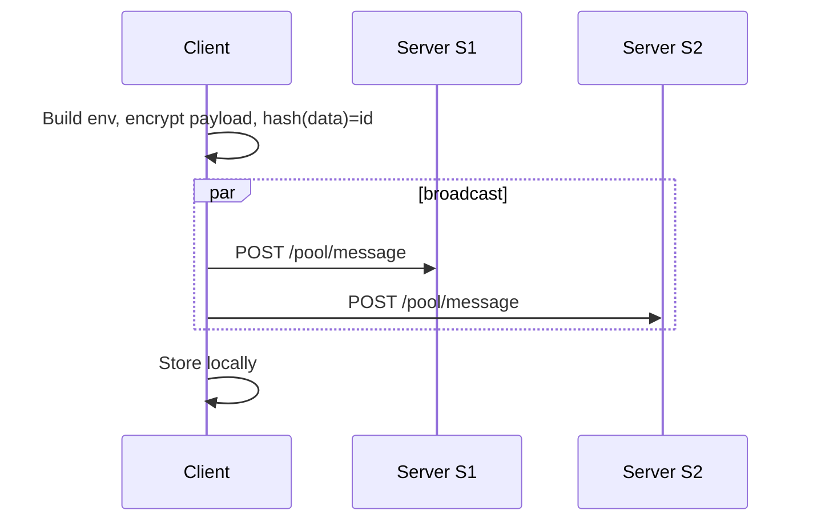
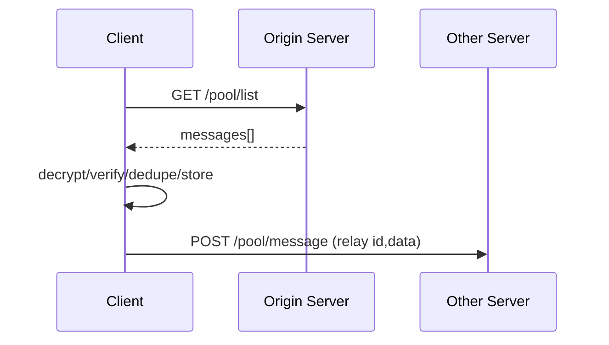
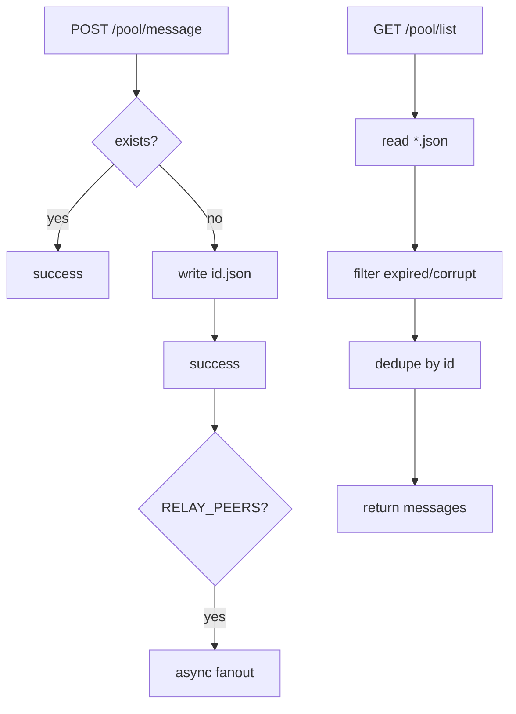

# MeshPath Mesh Chat (Client-driven Replication)

[中文文档 / Chinese Version](./MESH_CHAT_DESIGN.md)

---

## 1. Client-side Logic and Principles

### 1.1 Core Modules
- useMeshChat (text rooms & messages)
  - Send: pack → encrypt → compute message ID → broadcast to all enabled servers
  - Receive: poll /pool/list → parse → decrypt → verify → dedupe & store → client relay to other servers
- useUser (profile & server list)
  - Maintain keypair and server list ({ url, enabled })
- Dexie (IndexedDB)
  - textRooms, textMessages for persistence and dedupe
- unsea crypto
  - Encrypt/decrypt payload, sign/verify `${roomId}:${msg}:${ts}`

### 1.2 Data Flows
- Send (client → multi servers)


- Receive & Client Relay (servers → client → other servers)


### 1.3 Key Algorithms
- Message ID = SHA-256 over encrypted `data` (base64url)
- Dedupe = processed set + Dexie query by (roomId, ts, senderPub)
- Client Relay = re-POST to all enabled servers except origin
- Verify = signature over `${roomId}:${msg}:${ts}`

### 1.4 Performance
- Promise.all parallel I/O for broadcast and polling
- Idempotent writes on server to avoid lock contention
- Dedupe on client and server sides
- TTL cleanup on server to keep pool small

---

## 2. Server Logic and Principles

### 2.1 Architecture
- Node.js + Express REST APIs
- File-based message pool (POOL_DIR)
- Global CORS
- Optional server-to-server fanout via RELAY_PEERS (not required)

### 2.2 Request Flows


### 2.3 Storage & Management
- id.json files under POOL_DIR
- TTL cleanup
- Idempotent write & /pool/list de-duplication

### 2.4 Security
- Server does not decrypt or verify payload
- CORS enabled for /pool/*
- Size and field validation

---

## 3. Usage Guide

### 3.1 Requirements
- Node.js 18+
- Modern browsers

### 3.2 Install & Run (dev)
```bash
# Frontend (MeshPath)
cd MeshPath
pnpm i
pnpm run dev

# Server
node server.js
```

### 3.3 Env Vars (server)
```env
RELAY_PORT=8765
POOL_DIR=./message_pool
POOL_TTL_MS=86400000
RELAY_PEERS=http://peer.example.com:8766
```

### 3.4 Common Ops
- Add multiple server URLs in UI and enable them
- Create/Join rooms with rpub/rpriv
- Send: broadcast to all
- Receive: poll any reachable server and then client-relay to others

### 3.5 Troubleshooting
- Only part of peers receive:
  - Ensure the sender enabled multiple servers
  - Ensure at least one user bridges multiple servers
  - Ensure ports are reachable and CORS works
- Duplicates:
  - Handled by idempotency and dedupe
- Dev build/HMR glitches:
  - Keep only one dev process and hard refresh
